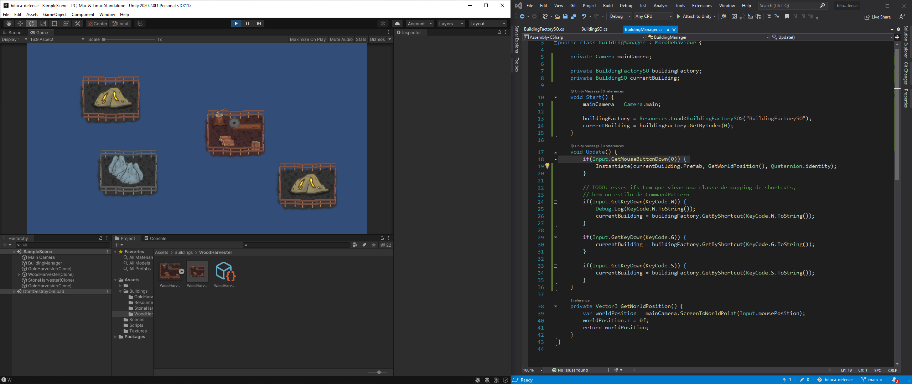
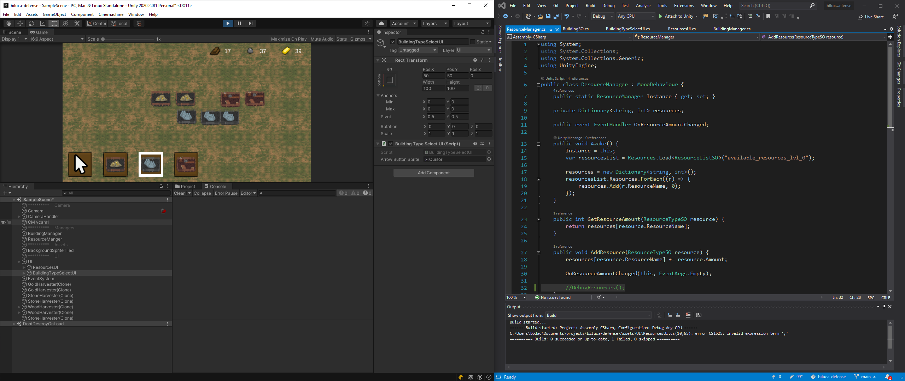
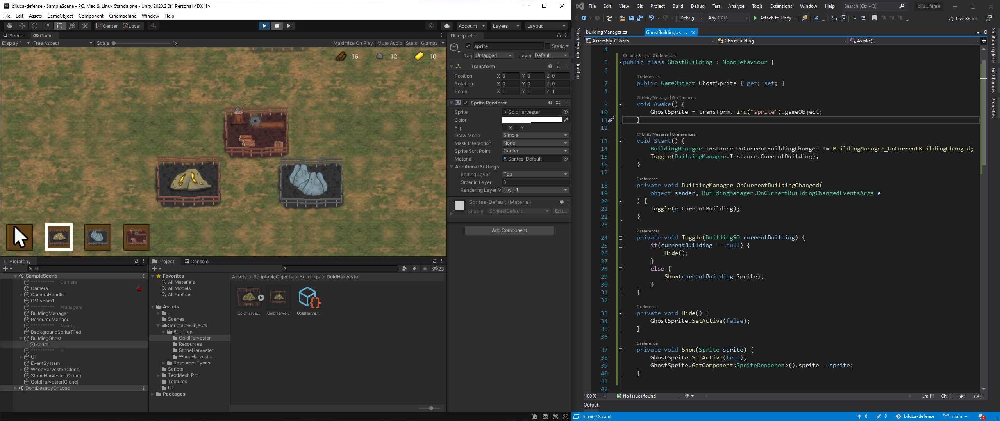
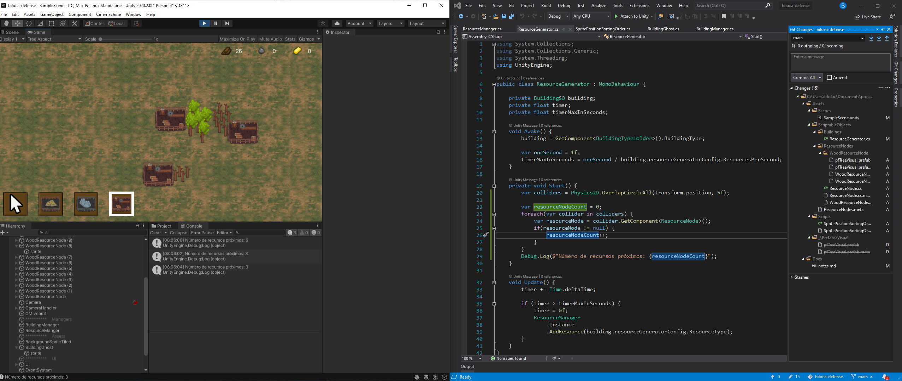
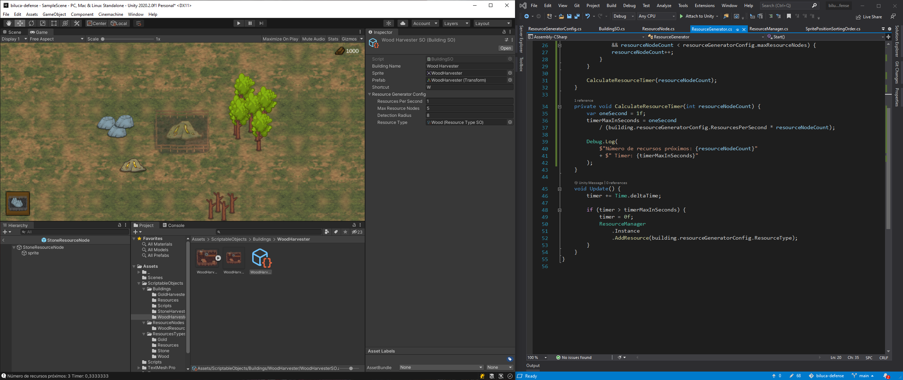
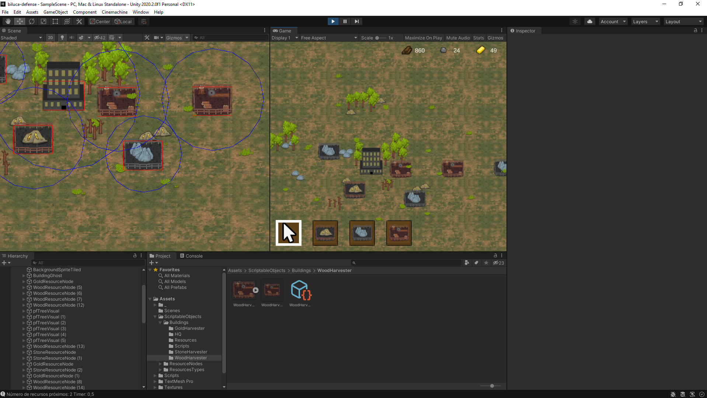

# biluca-defense
Build a awesome Tower Defense game, with a lot of systems and effects

# Dia 2

- Criação de scriptable objects para criação de construções dinamicamente
  - BuildingSO
  - BuildingFactorySO
- Mapeamento de atalhos (shortcuts) para alteração do tipo a ser construído
- Melhoria na estrutura do projeto



# Dia 4

- Criação do sistema de gerenciamento de recursos
- Criação do sistema de movimentação de câmera
  - Utilizando as teclas ```up, down, left, right```
- UI para selecionar as construções



# Dia 5

- Criação do fantasma das construções para dar um preview ao jogador de como a construção estará no mundo



# Dia 6

- Criação do nodos de recursos
- Implementação do sistema para buscar recursos próximos as construções



# Dia 7

- Criação dos outros nodos de recursos
- Configuração de geração de recursos para todos os nodos



# Dia 8

- Criação da edificação de HQ, principal estrutura do jogo
- Criação das regras de construção das edificações


