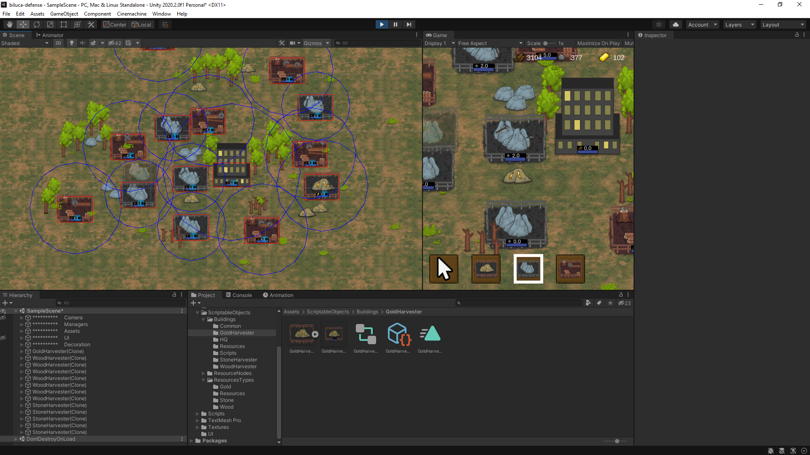
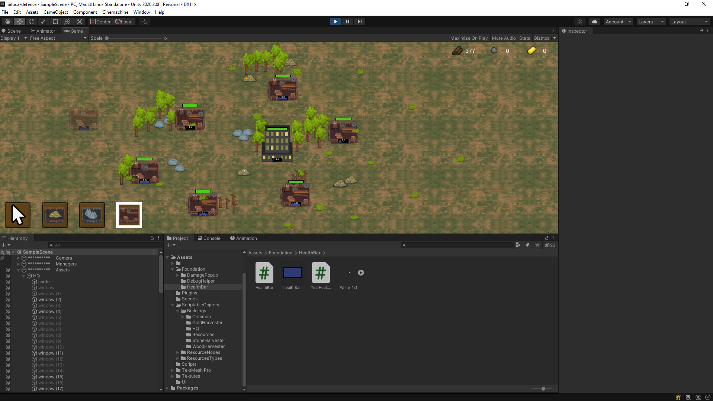
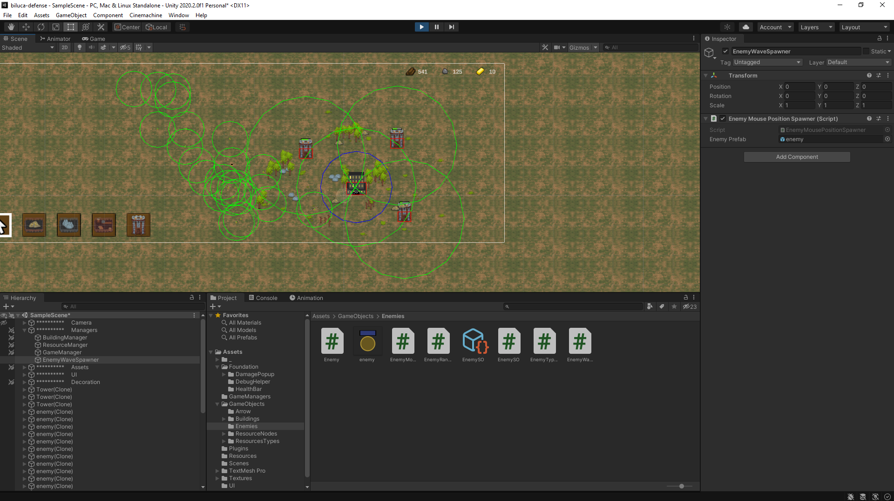
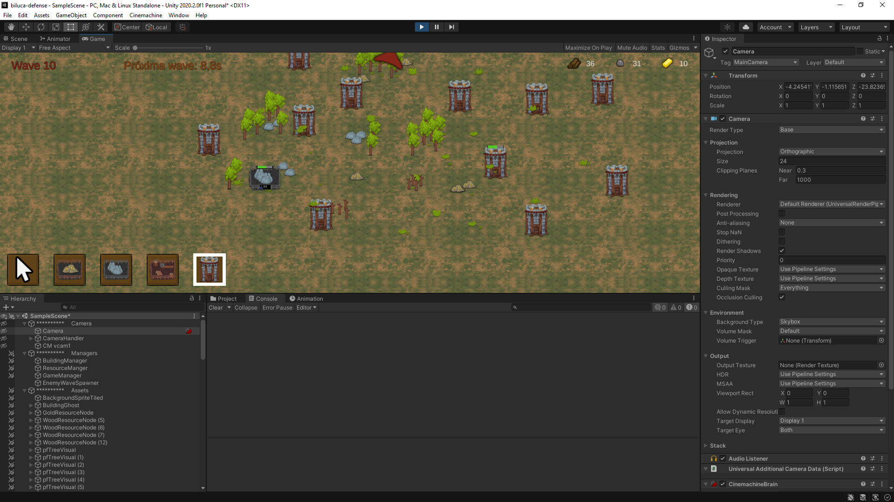
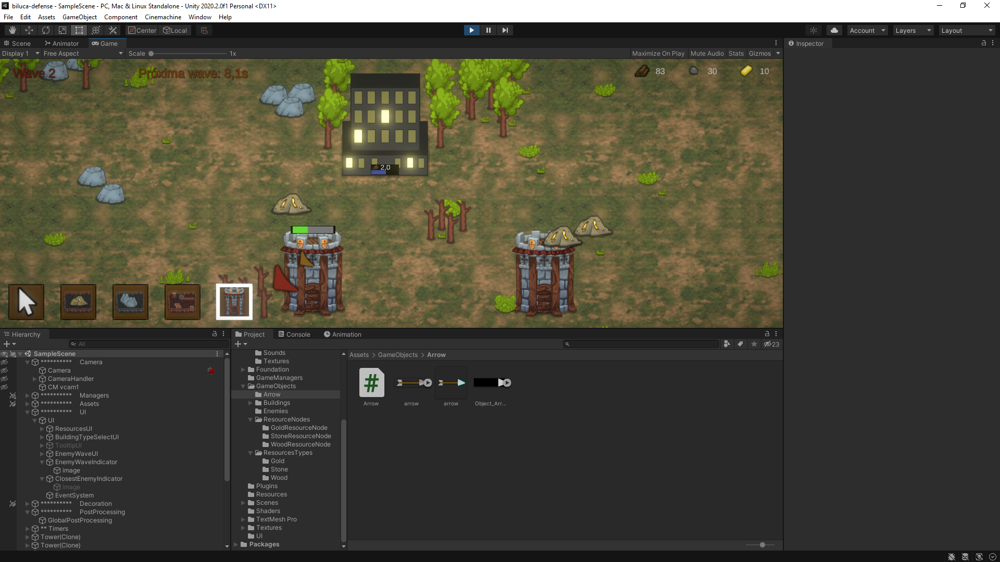
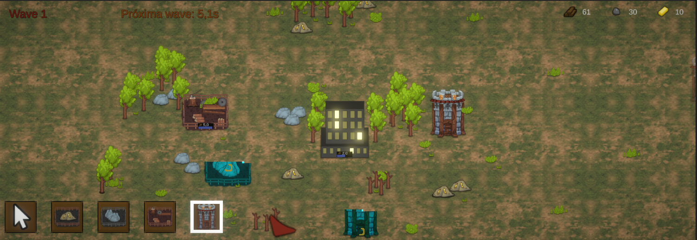
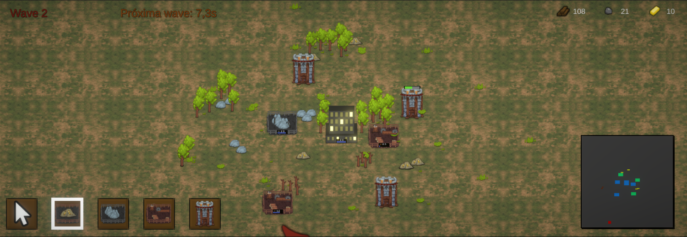

# biluca-defense
Build a awesome Tower Defense game, with a lot of systems and effects

# Dia 2

- Criação de scriptable objects para criação de construções dinamicamente
  - BuildingSO
  - BuildingFactorySO
- Mapeamento de atalhos (shortcuts) para alteração do tipo a ser construído
- Melhoria na estrutura do projeto


# Dia 4

- Criação do sistema de gerenciamento de recursos
- Criação do sistema de movimentação de câmera
  - Utilizando as teclas ```up, down, left, right```
- UI para selecionar as construções


# Dia 5

- Criação do fantasma das construções para dar um preview ao jogador de como a construção estará no mundo


# Dia 6

- Criação do nodos de recursos
- Implementação do sistema para buscar recursos próximos as construções


# Dia 7

- Criação dos outros nodos de recursos
- Configuração de geração de recursos para todos os nodos


# Dia 8

- Criação da edificação de HQ, principal estrutura do jogo
- Criação das regras de construção das edificações


# Dia 9

- Criação do overlay para exibir a quantidade de recursos coletados, melhorando assim a visualização para o usuário
- Criação do overlay para exibir a eficiência de uma edificação ser construída naquele lugar



# Dia 10-11

- Criação de sistema de tooltip para exibir mensagens para o usuário
- Criação de sistema de vida para as edificações



# Dia 12

- Criação dos inimigo
- Criação de invocação do inimigo



# Dia 13-16

- Criação do sistema de ondas dos inimigos
- Várias refatorações no código para desacoplar várias mecânicas que podem ser utilizadas em outros projeto



- Adição de Post Processing no jogo para ficar mais legal



# Dia 17-19

- Adição de efeito e tempo para a construção das edificações, utilizando shaders para criar um efeito legal



# Dia 20

- Adição do botão para destruir as edificações criadas e assim recuperar um pouco de recurso

